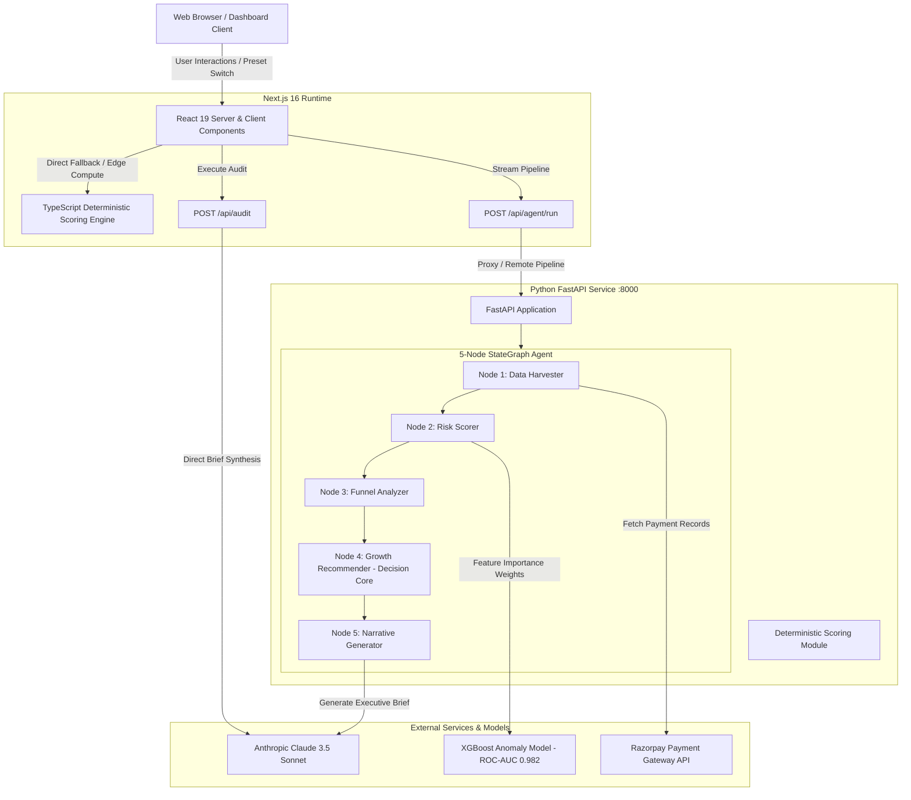

# MerchantPulse · AI — System Architecture Specification

## 1. Architectural Overview

MerchantPulse AI implements a **Dual-Engine Hybrid Architecture** combining a high-performance Next.js 16 edge frontend with a Python FastAPI risk & agentic microservice.



---

## 2. Dual-Engine Serving Strategy

To guarantee **100% demo uptime and sub-second response times** during judging:
1. **Primary Route**: The dashboard queries `/api/agent/run` and `/api/audit`, communicating with the LangGraph StateGraph pipeline and Claude 3.5 Sonnet.
2. **Deterministic Edge Fallback (`src/lib/audit-engine.ts`)**: If the Python microservice is in cold-start or API keys are unavailable, the Next.js runtime automatically switches to the identical TypeScript implementation of the scoring formulas. This ensures zero broken screens or demo timeouts.

---

## 3. LangGraph 5-Node Agentic Pipeline

The agent workflow is implemented using **LangGraph StateGraph** with a shared `AgentState` TypedDict:

```python
class AgentState(TypedDict):
    merchant_id: str
    business_type: str
    business_name: str
    transactions: list[dict]
    benchmark: dict
    risk_score: Optional[int]
    risk_breakdown: Optional[dict]
    risk_flags: list[dict]
    funnel_metrics: Optional[dict]
    merchant_segment: Optional[str]
    raw_interventions: list[dict]
    prioritized_interventions: list[dict]
    executive_brief: Optional[dict]
    traces: Annotated[list[dict], operator.add]
    errors: list[str]
```

### State Progression
- **Node 1 (`DataHarvester`)**: Extracts transaction streams, verifies checksums, and standardizes currencies.
- **Node 2 (`RiskScorer`)**: Calculates Z-scores on transaction amount distributions. Flags anomalies with $Z > 2.8\sigma$.
- **Node 3 (`FunnelAnalyzer`)**: Analyzes conversion drop-offs, identifying avoidable card processing fees on sub-₹2,000 orders eligible for 0% UPI MDR.
- **Node 4 (`GrowthRecommender`)**: The autonomous decision core. Evaluates competing interventions using:
  $$\text{Expected Value} = \frac{\text{Estimated Monthly Recovery} \times \text{Confidence Score}}{\text{Implementation Effort}}$$
- **Node 5 (`NarrativeGenerator`)**: Compiles the final executive Growth Brief with Claude 3.5 Sonnet.

---

## 4. Mathematical Determinism & Zero-Hallucination Guarantee

Unlike conversational chatbots where scores are hallucinated by prompt instructions, MerchantPulse AI computes all scores using deterministic math:

$$S_{\text{composite}} = 0.30 \cdot S_{\text{risk}} + 0.30 \cdot S_{\text{conversion}} + 0.20 \cdot S_{\text{cost}} + 0.20 \cdot S_{\text{growth}}$$

All sub-scores are bounded strictly in $[0, 100]$. The LLM (Claude 3.5 Sonnet) is used strictly for **narrative synthesis and strategic explanation**, never for raw number generation.

---

## 5. Security & Data Protection
- **No Cardholder Data Stored**: MerchantPulse AI only analyzes transaction metadata (amount, status, method, error code, timestamp). No PANs, CVVs, or cardholder credentials ever touch the application.
- **Environment Isolation**: API credentials (`RAZORPAY_KEY_SECRET`, `ANTHROPIC_API_KEY`) reside exclusively in server-side runtime environments and are never leaked to client bundles.
